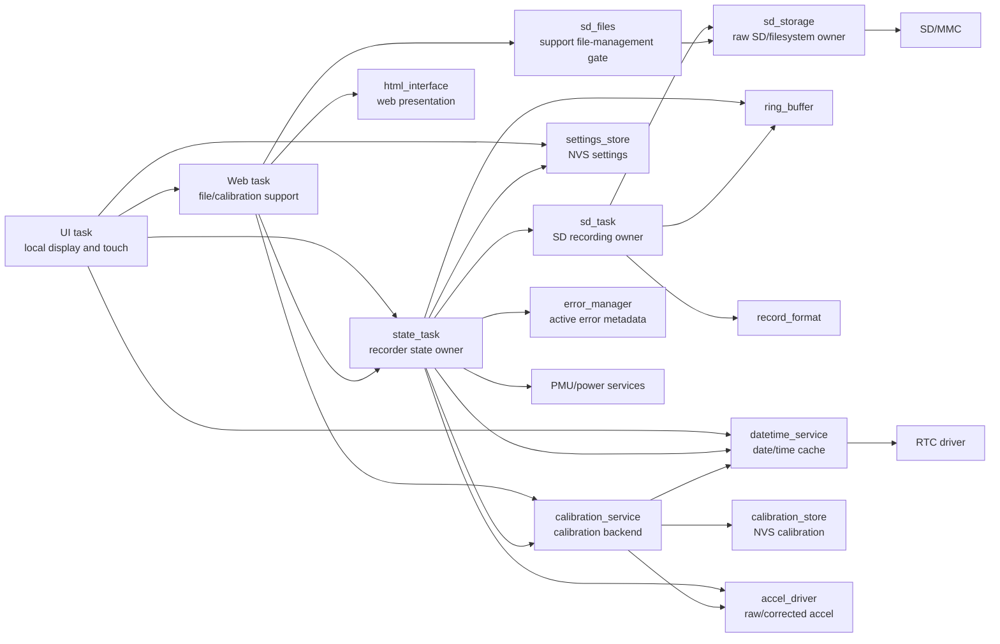

<!--
SPDX-License-Identifier: PolyForm-Noncommercial-1.0.0
Copyright (c) 2026 AgingGliders
-->

# Recorder Architecture

## 1. Purpose

This document captures the recorder software architecture and operating concept.

This document defines the recorder software architecture and operating concept so that:

- requirements remain in `01_recorder_requirements.md`;
- architecture and scope decisions remain here;
- detailed state-machine behavior remains in `03_state_machine_behavior_review.md`.

## 2. Scope and Operating Concept

The recorder is a Waveshare ESP32-S3 AMOLED 2.06 embedded device that:

- starts through PMU/hardware-managed power behavior;
- initializes application drivers and services after firmware boot;
- displays local recorder status and setup information;
- requires user settings and valid calibration before recording;
- records corrected acceleration samples at 20 Hz;
- writes recording files to SD card;
- stores required settings and latest calibration in NVS;
- provides Web support for file management and calibration when not recording.

The project is a prototype/controlled-development baseline, not a formal certification package.

## 3. Controlled and Support Function Boundaries

Controlled recorder-core behavior includes:

- recording authorization;
- state transitions between BOOT, READY, STARTING, RECORDING, STOPPING, ERROR, and OFF;
- SD file open/write/close behavior;
- acceleration acquisition and correction;
- calibration backend capture, calculation, storage, and lockout behavior;
- required settings storage and setup lockout;
- user-visible operational messages that affect recorder use;
- recording file binary format.

Support behavior includes:

- visual styling of local UI pages;
- Web page presentation;
- file-management convenience features;
- external board/library behavior not owned by the application.

Important boundary:

- Web/UI presentation is support functionality.
- However, controls and displayed values that affect setup, calibration, recording authorization, or shutdown are documented operationally because they affect recorder use.

## 4. Hardware-Managed Power Functions

The following behaviors are managed by PMU hardware and are not allocated to application software:

- power-button start from off;
- USB start from off;
- forced unconditional shutdown by long power/clear-button press.

Application software handles behavior after firmware boot and application-level shutdown requests such as:

- shutdown hold while READY;
- shutdown hold while RECORDING, with close-before-shutdown;
- USB-loss shutdown while READY;
- low-power shutdown.

## 5. Architectural Principles

1. Each task owns its own state.
2. `state_task` owns high-level recorder state and recording authorization.
3. `sd_task` owns the SD recording file lifecycle.
4. `sd_storage` owns raw SD/filesystem access.
5. `settings_store` owns persistent user setup data.
6. `datetime_service` owns the shared application date/time cache.
7. `calibration_service` owns calibration status, capture session state, calculation, and active-calibration status.
8. `calibration_store` owns persistent latest calibration and calibration-fault latch in NVS.
9. `accel_driver` owns hardware accelerometer access and applies active calibration to normal recorder reads.
10. `ring_buffer` decouples the 20 Hz acquisition path from SD-card write latency to minimize acquisition jitter.
11. `error_manager` owns active user-visible error metadata.
12. Support Web/UI operations must not interfere with active recording.
13. Fixed-size buffers and configured limits are preferred in recorder-core code.

## 6. Architecture Relationship Diagram



## 7. Module Responsibilities

| Module | Responsibility |
|---|---|
| `state_task` | Owns recorder state, recording authorization, setup-lock behavior, calibration service tick, and transition to start/stop/error/off states |
| `sd_task` | Owns recording file open/write/close and SD recording errors |
| `sd_storage` | Owns raw SD/MMC and filesystem operations |
| `sd_files` | Provides authorized support file-management access for Web operations |
| `ring_buffer` | Buffers formatted recording blocks between acquisition and SD writing |
| `record_format` | Builds recording data/status/calibration records and the daily recording filename prefix |
| `settings_store` | Stores and loads required user settings in NVS |
| `datetime_service` | Provides shared date/time cache and RTC synchronization |
| `calibration_store` | Stores latest valid calibration and calibration-fault latch in NVS |
| `calibration_service` | Owns calibration status, rolling-window capture, face detection, gain/offset calculation, fault behavior, and active-calibration interface |
| `accel_driver` | Reads raw accelerometer data and returns corrected accelerometer data for normal recorder operation |
| `error_manager` | Maps active errors to clearability and user-visible messages |
| `ui_task` | Renders local display, touch, menu/settings pages, display dimming, and message display |
| `web_task` | Owns WiFi/AP lifecycle and Web endpoints for file support, calibration support, and firmware update |
| `html_interface` | Embedded Web page presentation |

## 8. State and Task Ownership

### 8.1 `state_task`

`state_task` is the only module that changes the high-level `recorder_state_t`.

It is responsible for:

- BOOT hardware/service initialization sequencing;
- READY setup-lock and recording authorization checks;
- STARTING request to open recording file;
- RECORDING acquisition, corrected acceleration reads, and ring-buffer feeding;
- STOPPING request to close recording file;
- ERROR clear/recovery handling;
- OFF shutdown request path;
- periodic calibration session service call while calibration is active.

### 8.2 `sd_task`

`sd_task` owns:

- SD/card boot and recovery handling;
- file open request handling;
- recording file write loop;
- low-space handling while writing;
- file close handling;
- SD error status consumed by `state_task`.

### 8.3 `ui_task`

`ui_task` owns local UI state and presentation. It reads the state snapshot and renders:

- main screen time/date/version/message/battery;
- menu page;
- settings pages;
- display brightness dimming.

The UI does not independently create recorder-core error messages.

### 8.4 `web_task`

`web_task` owns WiFi/AP lifecycle and Web endpoints. The `AsyncWebServer` object is allocated once, routes are registered once, and the listener is started once. Web ON/OFF controls the ESP32 access point and application-side cleanup/authorization, not the lifetime of the HTTP listener.

This server-once lifecycle is intentional. The selected AsyncWebServer/AsyncTCP stack does not provide a reliable port-80 stop/restart lifecycle after HTTP traffic, so the listener remains alive while Web access is controlled by the AP lifecycle.

The Web page is support presentation. Calibration backend logic resides in `calibration_service`; Web handlers request actions and display backend state. Firmware update upload handling resides in `web_task` and uses the ESP32 Arduino `Update` API. A permanent `/diag` route provides a lightweight Web/AP health check.

Calibration Web access is intentionally gated because calibration is a maintenance/mechanical activity. The operator must unlock calibration using the recorder registration string. After authorization, the Web UI shows a calibration menu with separate Accelerometer Calibration and Installation Calibration entries and the last saved date for each calibration type. Calibration action/sample/save endpoints require the same per-client calibration authorization.

## 9. Calibration Architecture

### 9.1 Persistent calibration ownership

`calibration_store` stores:

- latest valid calibration record;
- calibration-fault latch.

Only the latest valid calibration is stored in NVS. Each recording file contains calibration block `0x72`, which provides the calibration record associated with that recording.

### 9.2 Calibration session ownership

`calibration_service` owns the active RAM-only calibration session.

The session is reset on start/cancel/restart. Partial sessions are not stored in NVS.

### 9.3 Calibration sampling

`state_task` calls:

```cpp
calibration_session_service(now);
```

The service samples raw accelerometer data at the configured calibration period while calibration is active.

Current configuration:

```cpp
#define CALIBRATION_SAMPLE_PERIOD_MS       50u
#define CALIBRATION_WINDOW_SAMPLE_COUNT    40u
```

### 9.4 Raw, sensor-corrected, and fully corrected acceleration paths

The accelerometer driver exposes three logical paths:

```text
accel_read_xyz_raw()              -> uncorrected raw milli-g sample for six-face sensor calibration
accel_read_xyz_sensor_corrected() -> gain/offset-corrected sample for installation calibration
accel_read_xyz()                  -> full correction chain for normal recorder operation
```

The sensor correction is:

```text
sensor_corrected = gain * raw + offset
```

The full recording path then applies the installation rotation matrix:

```text
recorded = installation_matrix * sensor_corrected
```

The driver applies the active correction chain but does not compute or store calibration.

## 10. Settings and Date/Time Architecture

`settings_store` owns persistent required settings:

- date-set flag;
- time-set flag;
- registration;
- WiFi password.

`datetime_service` owns the current application date/time cache and synchronizes with the RTC. UI reads the cache for display; state/recording uses the cache for filenames and calibration freshness checks.

## 11. Error and Message Architecture

`error_manager` owns active error metadata, including whether an error is clearable.

`state_task_get_status()` overlays active error-manager messages on the state snapshot. `ui_task` renders the effective message but does not choose recorder-core error messages.

Setup-lock messages such as settings required, calibration required, and calibration fault keep the device in READY and allow menu access for setup/recovery.

## 12. Performance and Timing Architecture

The recorder sample-rate requirement is 20 Hz. Acceleration values are recorded as signed 16-bit integers.

The QMI8658 accelerometer is configured for ±8 g range, 1000 Hz hardware output data rate, and hardware LPF mode 0. The 20 Hz recording rate is the application-level acquisition/recording cadence, so hardware sampling and filtering are configured above the recorded data rate.

The acquisition path and SD-writing path are intentionally separated:

```text
core 0: state_task / acquisition timing
        -> ring_buffer
core 1: sd_task / SD file writing
```

Rationale:

- SD-card write latency can vary.
- Acquisition timing jitter should be minimized.
- The ring/circular buffer absorbs SD write latency so acquisition does not directly block on SD writes.
- Key timing-sensitive and latency-sensitive tasks are distributed across ESP32-S3 cores: acquisition/state timing on one core and SD writing on the other core.

Current core allocation:

| Task | Core |
|---|---:|
| `state_task` / acquisition timing | 0 |
| `sd_task` / SD writing | 1 |
| `ui_task` | 1 |
| `web_task` | 0 |

Recorded-file validation on `FCFAG_20260517_222418.bin` showed:

```text
avg_ms=50.000
min_ms=50
max_ms=50
stddev_ms=0.000
derived_rate_hz=20.000
result: PASS
```

## 13. Recording Format Architecture

The recording format is specified in `01_recorder_requirements.md`, Section 8.

The implemented block sequence is:

```text
0x72 calibration block
0x70 acceleration block
...
0x71 status block
```

## 14. Concurrency and Access Rules

- High-level state changes occur only in `state_task`.
- Recording file lifecycle changes occur only in `sd_task`.
- Raw SD/filesystem access is serialized through SD/storage modules.
- Web file operations are authorized only when recording is not active.
- Calibration sampling is serviced by `state_task`; Web handlers own operator lifecycle actions such as start, cancel, status, and save. Shared calibration session state is protected by the calibration-service mutex so Web lifecycle actions and state-task sampling cannot observe partially updated session state.
- Display brightness changes are owned by `ui_task`, which owns LVGL/display interaction.
- Date/time cache access is protected inside `datetime_service`.
- Settings and calibration persistence are owned by their respective store modules.

## 15. UI Color Semantics

Button color semantics are defined by requirements: blue for normal active actions, orange for active setup/recovery-required actions, gray for inactive actions, and green for back/return navigation.

## 16. UI Guidance Color Rule

Orange buttons form an operator guidance path to resolve the current blocking condition. For example, settings-required follows MENU -> SETTINGS -> missing setting buttons; calibration-required follows MENU -> START WIFI -> Web calibration page.

## 17. Display Standby Architecture

After the configured display inactivity timeout, the UI may switch directly to display standby. In standby the AMOLED output is switched off, the panel supply controlled by `LCD_EN` is disabled, and the display appears black with no standby text.

Display standby is a UI sub-state, not a recorder state. It is page-independent for normal recorder UI pages: main, MENU, SETTINGS, setting-edit pages, and WiFi-support pages may all be replaced by the standby screen. The active message does not by itself prevent standby. The dedicated low-battery shutdown notice is excluded because it must remain visible until PMU shutdown.

While standby is active, the UI task skips the normal `updateUI()` refresh and runs at a reduced loop rate, currently about 5 Hz in standby while keeping LVGL/touch processing active for wake detection. Wake conditions are touch, power/clear button press, record button press, or USB insertion. On wake, the display supply is re-enabled and the UI restores the previously active page at full brightness.

## 18. WiFi Support Power Rule

WiFi/AP support is user-selected from MENU. The AP is stopped when the operator selects STOP WIFI or when `state_task` disables Web support during state transitions such as recording. While WiFi is active, the screen START RECORD button is disabled/gray. The physical RECORD button remains authoritative; if it starts recording while WiFi is active, READY exit cleanup turns WiFi/Web OFF before STARTING/RECORDING.

The HTTP listener is not stopped in normal operation. It remains allocated and started once because the tested AsyncWebServer/AsyncTCP stack does not reliably recover port-80 dispatch after `AsyncWebServer::end()` has been called following real HTTP traffic. When Web support is OFF, the listener is not exposed to the operator because the AP is down and SD file-management authorization is disabled.

The UI loop runs standby/wake selection before `lv_timer_handler()` so the display-off transition happens without leaving the normal UI shown as a dimmed intermediate frame.

The date/time cache continues to be refreshed during RECORDING so the active UI clock updates normally. Recording sample timing uses the captured start time plus the monotonic ESP timer and does not depend on periodic RTC reads.

## 19. Recording Clock Display During Standby

The selected release solution is intentionally simple:

- while the display is active, the shared date/time cache continues to be refreshed, including during RECORDING, so the visible clock updates normally;
- while the display is in standby, normal UI refresh is skipped, so the visible clock is not updated because it is not displayed;
- recording sample timestamps do not depend on periodic RTC reads. They use the recording start time captured at start plus the monotonic ESP timer.

This avoids adding a second date/time derivation path in the UI and avoids date rollover complexity before release.

Touch sampling remains enabled in RECORDING so the standby display can wake from touch while acquisition and SD writing continue.

Standby is allowed from MENU, SETTINGS, and setting-edit pages. Waking restores the page that was visible before standby.

## 20. SD Archive Behavior

The Web Archive action for root-level recording files is implemented as a move to `/processed`; the folder is created if needed, and destination name collisions are resolved with a numeric suffix. The normal Web file list remains root-file oriented, so processed files are hidden from the active file list. A separate Maintenance / Delete page lists files already in `/processed` and permanently deletes selected archived files when the operator confirms deletion.

### 11.5 Daily recording file policy

Recording files are grouped by registration and date. `record_format` builds the date-only prefix `/REGISTRATION_YYYYMMDD`. `sd_storage` owns the filesystem policy that turns this prefix into `/REGISTRATION_YYYYMMDD_N.bin`.

The first session of a day creates `_1.bin`. If another session starts on the same day, the existing daily file is renamed to the next suffix and then opened in append mode. The suffix therefore records how many sessions have been started in that daily file.

Only root-level files matching the daily filename pattern are selected for append/rename matching. Files under `/processed` or any other subdirectory are ignored, even if their basename matches the daily registration/date prefix. Files with any other recording-file naming pattern are left unchanged.

## 21. SD Maintenance While READY

SD max-file-count is treated as a Web-maintenance condition when the recorder is not recording and SD free space is still above the recording-start threshold. It blocks recording start but keeps the high-level recorder in READY so MENU and START WIFI remain available for Web file maintenance. SD low-space is not a Web-maintenance condition because archiving files to `/processed` does not free SD memory; the operator must replace the SD card or free space outside the recorder.


Low-battery shutdown uses a dedicated user notice path. When the PMU reports battery percentage at or below `PMU_BATT_LOW_THRESHOLD_PCT` and USB is not present, the state task requests shutdown from any state. If a recording is open, the SD close path is completed first. The UI then shows a black full-screen red notice, `BATTERY LOW` / `RECHARGE WITH USB`, for `CFG_LOW_BATTERY_NOTICE_MS` before PMU power-down is requested.

Orange means a user-resolvable action or condition that can be cleared through the device workflow. Red is reserved for blocking conditions that cannot be cleared through the current device workflow. Therefore `SD FULL (FILES)` is orange because Web archive can clear the root-file-count condition, while `SD LOW` remains blocking because archiving does not free SD memory.

## 22. Project-local Board and LVGL Configuration

The firmware shall not depend on board or LVGL configuration headers being manually installed in the global Arduino libraries folder.

Project-local configuration files:

```text
src/board/pin_config.h
lv_conf.h
```

`src/board/pin_config.h` owns the Waveshare ESP32-S3 AMOLED 2.06 pin mapping. `lv_conf.h` owns the LVGL 9.3.0 build configuration for this firmware.

## 23. Direct FT3168 Touch Driver

The firmware accesses the FT3168 touch controller directly using the shared
Wire/I2C bus. Arduino_DriveBus is not required. The driver performs a bounded
reset/init retry sequence at BOOT, then uses the FT3168 interrupt line and
coordinate registers to report raw touch coordinates.


## 24. Software Watchdog

A lightweight software watchdog service records heartbeats from critical
recorder tasks. The Arduino `.ino` loop acts as an independent checker so the
state and SD state machines do not supervise only themselves.

The watchdog uses one timeout value, `WATCHDOG_TIMEOUT_MS`, for all required
sources. `state_task` and `sd_task` are required continuously. The recording
heartbeat is required only while the recorder is in `ST_RECORDING`.

A timeout stores a persistent NVS flag before shutdown. On the next startup,
after UI and state-task local services are initialized, the startup path shows
`FATAL WDG/CLR` before normal BOOT checks continue so the operator knows that
the previous stop was caused by a watchdog fault.

### SD Free-Space Threshold Hysteresis

The SD layer uses two free-space thresholds. `SD_RECORD_START_MIN_FREE_MB` is the higher threshold required before opening a new recording. `SD_RECORD_LOW_FREE_MB` is the lower threshold used while a recording is already active.

This hysteresis prevents a recording from being allowed just above the low-space limit and then immediately stopping with `SD LOW` after the first writes. During recording, the SD storage layer uses its cached free-space estimate to detect when the lower in-recording threshold has been crossed and the SD task then closes the file through the normal low-space close path.


## 25. Sensor and Installation Calibration Architecture

The recorder uses two calibration layers in the acceleration path:

```text
raw accelerometer sample
  -> sensor gain/offset correction
  -> installation rotation matrix
  -> ring buffer / recording file
```

The six-face sensor calibration corrects accelerometer gain and offset. The installation calibration is separate and is performed after the recorder is mounted in the glider. During sensor calibration the service keeps a rolling sample window for the current face and retains the best capture using the dominant face-axis stddev as the quality metric. The Web interface reports a simplified progress summary: validity status with NVS date when valid, session state, active face, samples processed on that face, current-face lowest stddev, current-face best-update count, time since the current face last improved, and a compact OK/— six-face completion summary. The summary uses plain text for unprocessed faces, amber for the active face only until it is processed, and green for processed faces. The face sample counter resets when the operator moves to a new face. The accelerometer workflow text advises waiting until the last best update is more than 10 seconds old on a face when practical, then saving when all six face values are satisfactory. During installation calibration the glider is placed in flight-level attitude with wings leveled, following the AMM procedure. The service reads sensor-corrected acceleration samples, keeps evaluating a rolling sample window, and computes a fixed 3 x 3 rotation matrix that maps the measured gravity vector to +Z. Installation candidate quality is the quadratic sum of the three axis stddev values, and an improved candidate replaces the complete candidate including the matrix. The installation Web page shows validity status with NVS date when valid, samples processed, lowest noise, update count, time since last best update, and the candidate or stored matrix. The installation workflow text advises waiting until the last best update is more than 10 seconds old when practical, then saving when noise is satisfactory.

The 3 x 3 matrix is stored in NVS as the installation-calibration part of the calibration record and is written into the 0x72 calibration block at the beginning of each recording. The sensor calibration and installation calibration each carry independent validity and timestamp fields. The NVS checksum is calculated over an explicit packed storage representation rather than over the runtime C++ structure, so the checksum is not affected by runtime struct padding or C++ `bool` representation. Yaw about the vertical axis is not observable from a static gravity measurement and is therefore not corrected by this calibration. The primary requirement is that corrected Z reads approximately +1 g in level-flight attitude.

Recording is allowed only when the sensor calibration is valid and the installation calibration exists.

## 26. SD-Owned Web Download Session

Web file-management operations are authorized only when the recorder is in READY and Web support is enabled. Active recording, SD open, SD write, and SD close states retain priority over support file-management operations.

Web downloads are implemented as an SD-owned sequential download session:

- `web_task` requests download begin/read/end operations through `sd_files`;
- `sd_files` serializes those requests and executes them from `sd_task`;
- `sd_storage` owns the open download file handle;
- the file is opened once at download start, read sequentially by chunk, and closed when the transfer ends or is aborted.

This avoids repeated open/seek/close cycles for each HTTP chunk while preserving the rule that SD filesystem access remains owned by the SD layer.

While the SD state machine is in `SD_IDLE` and SD file-management is authorized, the SD task may use `SD_TASK_FILE_OP_PERIOD_MS` instead of `SD_TASK_PERIOD_MS` to improve Web file-management responsiveness. This shorter period is not used during SD boot, recording open, recording write, recording close, or SD error handling.

## 27. Web Listener Lifecycle

The Web listener uses a server-once lifecycle:

1. `web_task_init()` allocates the `AsyncWebServer` object and registers routes.
2. The first Web ON starts the AP and calls `s_server->begin()`.
3. Later Web ON cycles start only the AP because the listener remains alive.
4. Web OFF performs application cleanup, aborts/ends support operations, clears locks/authorization, and stops the AP. It does not call `s_server->end()` and does not delete/recreate the server.

This is an implementation constraint of the selected AsyncWebServer/AsyncTCP stack. The port-80 AsyncWebServer listener is treated as a process-lifetime object, while externally visible access is controlled through the AP lifecycle.

The `/diag` route is kept as a permanent health endpoint. It reports basic Web/AP state such as cycle count, heap, AP IP address, station count, Web request flag, and listener-started flag.

## 28. Web Download and Flight-Time Analysis

The Web file-management page downloads the selected daily `.bin` file to the browser. The same in-memory buffer is analyzed locally to identify detected flight times. The displayed analysis is intentionally limited to the flight-time table plus sample-period average and standard deviation. Kossira/occurrence/load-factor spectrum calculation and CSV export are not active in this release baseline.

## 29. Web OTA Firmware Update

The firmware uses a project-local `partitions.csv` file for OTA-capable builds. The partition table provides two OTA application slots so a new application image can be written to the inactive slot while the current firmware continues running.

Firmware update is exposed as a manual Web maintenance function from the recorder access point. The operator selects Firmware Update in the Web interface and uploads the recorder application binary named like `SLM_recorder_date_version.bin`. 

`web_task` owns the OTA endpoint and streams the uploaded file to the ESP32 Arduino `Update` API. USB power is required before the update begins. If USB power is not present, the upload is rejected and the current firmware remains active.

After the update image is written and accepted by the update API, `web_task` sends the final Web response and requests a restart. Boot selection of the new OTA application is handled by the ESP32 OTA boot infrastructure.

