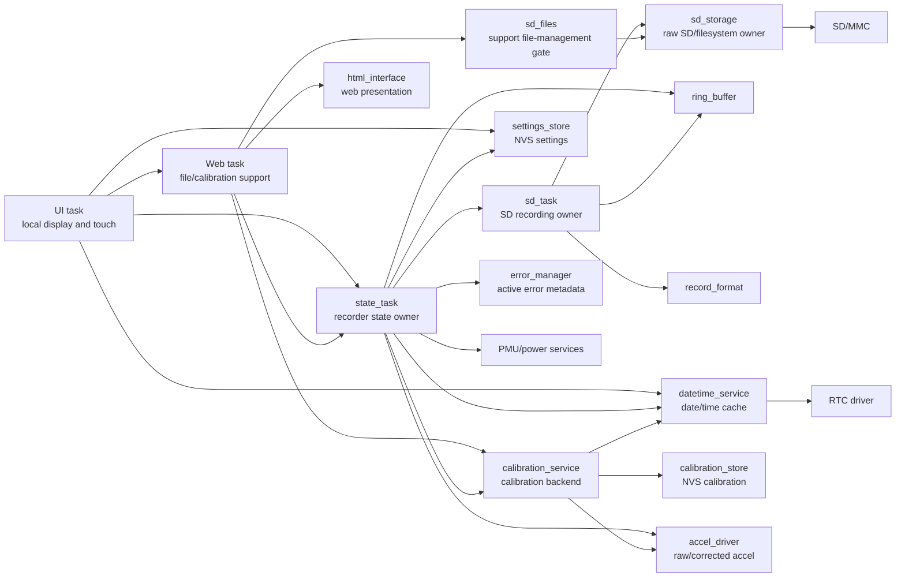

<!--
SPDX-License-Identifier: PolyForm-Noncommercial-1.0.0
Copyright (c) 2026 AgingGliders
-->

# Recorder Architecture

## 1. Purpose

This document captures the recorder software architecture and operating concept.

This document defines the recorder software architecture and operating concept so that:

- requirements remain in `01_recorder_requirements.md`;
- architecture and scope decisions remain here;
- detailed state-machine behavior remains in `03_state_machine_behavior_review.md`.

## 2. Scope and Operating Concept

The recorder is a Waveshare ESP32-S3 AMOLED 2.06 embedded device that:

- starts through PMU/hardware-managed power behavior;
- initializes application drivers and services after firmware boot;
- displays local recorder status and setup information;
- requires user settings and valid calibration before recording;
- records corrected acceleration samples at 20 Hz;
- writes recording files to SD card;
- stores required settings and latest calibration in NVS;
- provides Web support for file management and calibration when not recording.

The project is a prototype/controlled-development baseline, not a formal certification package.

## 3. Controlled and Support Function Boundaries

Controlled recorder-core behavior includes:

- recording authorization;
- state transitions between BOOT, READY, STARTING, RECORDING, STOPPING, ERROR, and OFF;
- SD file open/write/close behavior;
- acceleration acquisition and correction;
- calibration backend capture, calculation, storage, and lockout behavior;
- required settings storage and setup lockout;
- user-visible operational messages that affect recorder use;
- recording file binary format.

Support behavior includes:

- visual styling of local UI pages;
- Web page presentation;
- file-management convenience features;
- external board/library behavior not owned by the application.

Important boundary:

- Web/UI presentation is support functionality.
- However, controls and displayed values that affect setup, calibration, recording authorization, or shutdown are documented operationally because they affect recorder use.

## 4. Hardware-Managed Power Functions

The following behaviors are managed by PMU hardware and are not allocated to application software:

- power-button start from off;
- USB start from off;
- forced unconditional shutdown by long power/clear-button press.

Application software handles behavior after firmware boot and application-level shutdown requests such as:

- shutdown hold while READY;
- shutdown hold while RECORDING, with close-before-shutdown;
- USB-loss shutdown while READY;
- low-power shutdown.

## 5. Architectural Principles

1. Each task owns its own state.
2. `state_task` owns high-level recorder state and recording authorization.
3. `sd_task` owns the SD recording file lifecycle.
4. `sd_storage` owns raw SD/filesystem access.
5. `settings_store` owns persistent user setup data.
6. `datetime_service` owns the shared application date/time cache.
7. `calibration_service` owns calibration status, capture session state, calculation, and active-calibration status.
8. `calibration_store` owns persistent latest calibration and calibration-fault latch in NVS.
9. `accel_driver` owns hardware accelerometer access and applies active calibration to normal recorder reads.
10. `ring_buffer` decouples the 20 Hz acquisition path from SD-card write latency to minimize acquisition jitter.
11. `error_manager` owns active user-visible error metadata.
12. Support Web/UI operations must not interfere with active recording.
13. Fixed-size buffers and configured limits are preferred in recorder-core code.

## 6. Architecture Relationship Diagram


```mermaid
flowchart LR
  UI[UI task\nlocal display and touch]
  WEB[Web task\nfile/calibration support]

  ST[state_task\nrecorder state owner]
  SD[sd_task\nSD recording owner]
  SDS[sd_storage\nraw SD/filesystem owner]
  SDF[sd_files\nsupport file-management gate]
  RB[ring_buffer]
  RF[record_format]
  SS[settings_store\nNVS settings]
  DT[datetime_service\ndate/time cache]
  CAL[calibration_service\ncalibration backend]
  CST[calibration_store\nNVS calibration]
  EM[error_manager\nactive error metadata]
  ACC[accel_driver\nraw/corrected accel]
  RTC[RTC driver]
  PMU[PMU/power services]
  WEBHTML[html_interface\nweb presentation]

  UI --> ST
  UI --> DT
  UI --> SS
  UI --> WEB

  WEB --> WEBHTML
  WEB --> SDF
  WEB --> CAL
  WEB --> ST

  ST --> SD
  ST --> RB
  ST --> SS
  ST --> DT
  ST --> CAL
  ST --> EM
  ST --> ACC
  ST --> PMU

  CAL --> CST
  CAL --> ACC
  CAL --> DT

  SD --> RB
  SD --> RF
  SD --> SDS

  SDF --> SDS
  DT --> RTC
  SDS --> SDMMC[SD/MMC]
```

## 7. Module Responsibilities

| Module | Responsibility |
|---|---|
| `state_task` | Owns recorder state, recording authorization, setup-lock behavior, calibration service tick, and transition to start/stop/error/off states |
| `sd_task` | Owns recording file open/write/close and SD recording errors |
| `sd_storage` | Owns raw SD/MMC and filesystem operations |
| `sd_files` | Provides authorized support file-management access for Web operations |
| `ring_buffer` | Buffers formatted recording blocks between acquisition and SD writing |
| `record_format` | Builds recording data/status/calibration records and the daily recording filename prefix |
| `settings_store` | Stores and loads required user settings in NVS |
| `datetime_service` | Provides shared date/time cache and RTC synchronization |
| `calibration_store` | Stores latest valid calibration and calibration-fault latch in NVS |
| `calibration_service` | Owns calibration status, rolling-window capture, face detection, gain/offset calculation, fault behavior, and active-calibration interface |
| `accel_driver` | Reads raw accelerometer data and returns corrected accelerometer data for normal recorder operation |
| `error_manager` | Maps active errors to clearability and user-visible messages |
| `ui_task` | Renders local display, touch, menu/settings pages, display dimming, and message display |
| `web_task` | Owns WiFi/AP lifecycle and Web endpoints for file support, calibration support, and firmware update |
| `html_interface` | Embedded Web page presentation |

## 8. State and Task Ownership

### 8.1 `state_task`

`state_task` is the only module that changes the high-level `recorder_state_t`.

It is responsible for:

- BOOT hardware/service initialization sequencing;
- READY setup-lock and recording authorization checks;
- STARTING request to open recording file;
- RECORDING acquisition, corrected acceleration reads, and ring-buffer feeding;
- STOPPING request to close recording file;
- ERROR clear/recovery handling;
- OFF shutdown request path;
- periodic calibration session service call while calibration is active.

### 8.2 `sd_task`

`sd_task` owns:

- SD/card boot and recovery handling;
- file open request handling;
- recording file write loop;
- low-space handling while writing;
- file close handling;
- SD error status consumed by `state_task`.

### 8.3 `ui_task`

`ui_task` owns local UI state and presentation. It reads the state snapshot and renders:

- main screen time/date/version/message/battery;
- menu page;
- settings pages;
- display brightness dimming.

The UI does not independently create recorder-core error messages.

### 8.4 `web_task`

`web_task` owns WiFi/AP lifecycle and Web endpoints. The `AsyncWebServer` object is allocated once, routes are registered once, and the listener is started once. Web ON/OFF controls the ESP32 access point and application-side cleanup/authorization, not the lifetime of the HTTP listener.

This server-once lifecycle is intentional. The selected AsyncWebServer/AsyncTCP stack does not provide a reliable port-80 stop/restart lifecycle after HTTP traffic, so the listener remains alive while Web access is controlled by the AP lifecycle.

The Web page is support presentation. Calibration backend logic resides in `calibration_service`; Web handlers request actions and display backend state. Firmware update upload handling resides in `web_task` and uses the ESP32 Arduino `Update` API. A permanent `/diag` route provides a lightweight Web/AP health check.

Calibration Web access is intentionally gated because calibration is a maintenance/mechanical activity. The operator must unlock calibration using the recorder registration string. After authorization, the Web UI shows a calibration menu with separate Accelerometer Calibration and Installation Calibration entries and the last saved date for each calibration type. Calibration action/sample/save endpoints require the same per-client calibration authorization.

## 9. Calibration Architecture

### 9.1 Persistent calibration ownership

`calibration_store` stores:

- latest valid calibration record;
- calibration-fault latch.

Only the latest valid calibration is stored in NVS. Each recording file contains calibration block `0x72`, which provides the calibration record associated with that recording.

### 9.2 Calibration session ownership

`calibration_service` owns the active RAM-only calibration session.

The session is reset on start/cancel/restart. Partial sessions are not stored in NVS.

### 9.3 Calibration sampling

`state_task` calls:

```cpp
calibration_session_service(now);
```

The service samples raw accelerometer data at the configured calibration period while calibration is active.

Current configuration:

```cpp
#define CALIBRATION_SAMPLE_PERIOD_MS       50u
#define CALIBRATION_WINDOW_SAMPLE_COUNT    40u
```

### 9.4 Raw, sensor-corrected, and fully corrected acceleration paths

The accelerometer driver exposes three logical paths:

```text
accel_read_xyz_raw()              -> uncorrected raw milli-g sample for six-face sensor calibration
accel_read_xyz_sensor_corrected() -> gain/offset-corrected sample for installation calibration
accel_read_xyz()                  -> full correction chain for normal recorder operation
```

The sensor correction is:

```text
sensor_corrected = gain * raw + offset
```

The full recording path then applies the installation rotation matrix:

```text
recorded = installation_matrix * sensor_corrected
```

The driver applies the active correction chain but does not compute or store calibration.

## 10. Settings and Date/Time Architecture

`settings_store` owns persistent required settings:

- date-set flag;
- time-set flag;
- registration.

The local AP password is not stored as a user setting. It is generated from the normalized registration as `SLM` followed by the registration in reverse order.

`datetime_service` owns the current application date/time cache and synchronizes with the RTC. UI reads the cache for display; state/recording uses the cache for filenames and calibration freshness checks.

## 11. Error and Message Architecture

`error_manager` owns active error metadata, including whether an error is clearable.

`state_task_get_status()` overlays active error-manager messages on the state snapshot. `ui_task` renders the effective message but does not choose recorder-core error messages.

Setup-lock messages such as settings required, calibration required, and calibration fault keep the device in READY and allow menu access for setup/recovery.

## 12. Performance and Timing Architecture

The recorder sample-rate requirement is 20 Hz. Acceleration values are recorded as signed 16-bit integers.

The QMI8658 accelerometer is configured for ±8 g range, 1000 Hz hardware output data rate, and hardware LPF mode 0. The 20 Hz recording rate is the application-level acquisition/recording cadence, so hardware sampling and filtering are configured above the recorded data rate.

The acquisition path and SD-writing path are intentionally separated:

```text
core 0: state_task / acquisition timing
        -> ring_buffer
core 1: sd_task / SD file writing
```

Rationale:

- SD-card write latency can vary.
- Acquisition timing jitter should be minimized.
- The ring/circular buffer absorbs SD write latency so acquisition does not directly block on SD writes.
- Key timing-sensitive and latency-sensitive tasks are distributed across ESP32-S3 cores: acquisition/state timing on one core and SD writing on the other core.

Current core allocation:

| Task | Core |
|---|---:|
| `state_task` / acquisition timing | 0 |
| `sd_task` / SD writing | 1 |
| `ui_task` | 1 |
| `web_task` | 0 |

Recorded-file validation on `FCFAG_20260517_222418.bin` showed:

```text
avg_ms=50.000
min_ms=50
max_ms=50
stddev_ms=0.000
derived_rate_hz=20.000
result: PASS
```

## 13. Recording Format Architecture

The recording format is specified in `01_recorder_requirements.md`, Section 8.

The implemented block sequence is:

```text
0x72 calibration block
0x70 acceleration block
...
0x71 status block
```

## 14. Concurrency and Access Rules

- High-level state changes occur only in `state_task`.
- Recording file lifecycle changes occur only in `sd_task`.
- Raw SD/filesystem access is serialized through SD/storage modules.
- Web file operations are authorized only when recording is not active.
- Calibration sampling is serviced by `state_task`; Web handlers own operator lifecycle actions such as start, cancel, status, and save. Shared calibration session state is protected by the calibration-service mutex so Web lifecycle actions and state-task sampling cannot observe partially updated session state.
- Accelerometer driver coefficients are published only by `state_task`, through `calibration_service_publish_driver_state()`, which is called on every READY tick and writes to `accel_driver` only when the effective calibration has actually changed. Calibration service and Web API paths update service state only; they never write driver coefficients. Because the only consumer of those coefficients is `recording_service()`, which also runs in `state_task`, publication and use are strictly ordered within one task and require no additional locking.
- `calibration_service_refresh_status()` is called both by `state_task` and, through Web operator calibration actions, by the asynchronous HTTP task. It takes the calibration-service mutex so the record read and the resulting status update are atomic with respect to the other caller.
- Display brightness changes are owned by `ui_task`, which owns LVGL/display interaction.
- Date/time cache access is protected inside `datetime_service`.
- Settings and calibration persistence are owned by their respective store modules.

## 15. UI Color Semantics

Button color semantics are defined by requirements: blue for normal active actions, orange for active setup/recovery-required actions, gray for inactive actions, and green for back/return navigation.

## 16. UI Guidance Color Rule

Orange buttons form an operator guidance path to resolve the current blocking condition. For example, settings-required follows MENU -> SETTINGS -> missing setting buttons; calibration-required follows MENU -> START WIFI -> Web calibration menu -> missing calibration page -> enabled Start/Save action. A calibration Start button that has become Cancel is intentionally blue because Cancel does not resolve the missing-calibration condition; disabled buttons remain gray.

## 17. Display Inactivity Architecture

Display inactivity is a UI sub-state owned entirely by `ui_task`; it is not a recorder state. The same inactivity timeout is used in both power cases, but the resulting display action depends on USB availability.

With USB absent, expiry enters full standby: AMOLED output is switched off, `LCD_EN` is disabled, normal `updateUI()` refresh is skipped, and the reduced-rate UI/LVGL/touch loop remains active only to detect wake conditions. With USB present, expiry does **not** enter standby; the panel remains active and brightness is reduced from `DISPLAY_BRIGHTNESS_ACTIVE` (255) to `DISPLAY_BRIGHTNESS_DIMMED` (128, approximately 50%).

The behavior is page-independent for normal recorder pages. The dedicated low-battery shutdown notice and any active recorder error force full brightness. Touch, power/clear button activity, record button activity, or USB insertion restores full brightness and restarts the inactivity timer. If USB is removed while already dimmed and the inactivity interval has expired, the next UI service cycle may enter full standby immediately.

The date/time cache continues to be refreshed during RECORDING while the display is active. Recording sample timing remains independent of UI refresh and uses the captured recording start time plus the monotonic ESP timer.

## 18. WiFi Support Power Rule

Manual WiFi/AP support remains user-selected from MENU. The intended AUTO WIFI policy is described in Section 30; in the v1.55 observe-only field-validation build it is simulated/logged only and does not actuate the actual AP. The AP is stopped when the operator selects STOP WIFI or when normal recorder transitions explicitly disable Web support. While actual WiFi is active, the screen START RECORD button is disabled/gray; the physical RECORD button retains manual authority.

The HTTP listener is not stopped in normal operation. It remains allocated and started once because the tested AsyncWebServer/AsyncTCP stack does not reliably recover port-80 dispatch after `AsyncWebServer::end()` has been called following real HTTP traffic. When Web support is OFF, the listener is not exposed to the operator because the AP is down and SD file-management authorization is disabled.

The UI loop runs standby/wake selection before `lv_timer_handler()` so the display-off transition happens without leaving the normal UI shown as a dimmed intermediate frame.

The date/time cache continues to be refreshed during RECORDING so the active UI clock updates normally. Recording sample timing uses the captured start time plus the monotonic ESP timer and does not depend on periodic RTC reads.

## 19. Recording Clock Display During Standby

The selected release solution is intentionally simple:

- while the display is active, the shared date/time cache continues to be refreshed, including during RECORDING, so the visible clock updates normally;
- while the display is in standby, normal UI refresh is skipped, so the visible clock is not updated because it is not displayed;
- recording sample timestamps do not depend on periodic RTC reads. They use the recording start time captured at start plus the monotonic ESP timer.

This avoids adding a second date/time derivation path in the UI and avoids date rollover complexity before release.

Touch sampling remains enabled in RECORDING so the standby display can wake from touch while acquisition and SD writing continue.

Standby is allowed from MENU, SETTINGS, and setting-edit pages. Waking restores the page that was visible before standby.

## 20. SD Archive Behavior

The Web Archive action for root-level recording files is implemented as a move to `/processed`; the folder is created if needed, and destination name collisions are resolved with a numeric suffix. If a root-level `.bin` recording has a matching companion `.log` file, the companion log is moved to `/processed` with the recording. The normal Web file list remains root-file oriented and shows `.bin` recordings, so processed files and root-level companion `.log` files are hidden from the active recording list. The `/processed` directory is an immutable archive and is not listed or removed through the recorder Web interface; bulk archive maintenance is performed directly on the removable SD card.

### 11.5 Daily recording file policy

Recording files are grouped by registration and date. `record_format` builds the date-only prefix `/REGISTRATION_YYYYMMDD`. `sd_storage` owns the filesystem policy that turns this prefix into `/REGISTRATION_YYYYMMDD_N.bin`.

The first session of a day creates `_1.bin`. Each later session creates a separate immutable file with the next suffix. The suffix identifies recording-session order for the registration/date; it no longer represents the number of sessions combined in one file.

`sd_storage` scans matching `.bin` names in both the SD root and `/processed`, keeps only the highest suffix, and creates the next file in the root. Existing root and archived files are never renamed, restored, reopened, or appended. Files with other names or extensions are ignored. A suffix-scan or new-file creation failure blocks recording and is reported as `SD FILE ERR`. Legacy appended files remain readable and unchanged.

## 21. SD Maintenance While READY

SD max-file-count is treated as a Web-maintenance condition when the recorder is not recording and SD free space is still above the recording-start threshold. It blocks recording start but keeps the high-level recorder in READY so MENU and START WIFI remain available for Web file maintenance. SD low-space is not a Web-maintenance condition because archiving files to `/processed` does not free SD memory; the operator must replace the SD card or free space outside the recorder.


Low-battery shutdown uses a dedicated user notice path. When the PMU reports battery percentage at or below `PMU_BATT_LOW_THRESHOLD_PCT` and USB is not present, the state task requests shutdown from any state. If a recording is open, the SD close path is completed first. The UI then shows a black full-screen red notice, `BATTERY LOW` / `RECHARGE WITH USB`, for `CFG_LOW_BATTERY_NOTICE_MS` before PMU power-down is requested.

Orange means a user-resolvable action or condition that can be cleared through the device workflow. Red is reserved for blocking conditions that cannot be cleared through the current device workflow. Therefore `SD FULL (FILES)` is orange because Web archive can clear the root-file-count condition, while `SD LOW` remains blocking because archiving does not free SD memory.

## 22. Project-local Board and LVGL Configuration

The firmware shall not depend on board or LVGL configuration headers being manually installed in the global Arduino libraries folder.

Project-local configuration files:

```text
src/board/pin_config.h
lv_conf.h
```

`src/board/pin_config.h` owns the Waveshare ESP32-S3 AMOLED 2.06 pin mapping. `lv_conf.h` owns the LVGL 9.3.0 build configuration for this firmware.

## 23. Direct FT3168 Touch Driver

The firmware accesses the FT3168 touch controller directly using the shared
Wire/I2C bus. Arduino_DriveBus is not required. The driver performs a bounded
reset/init retry sequence at BOOT, then uses the FT3168 interrupt line and
coordinate registers to report raw touch coordinates.


## 24. Software Watchdog

A lightweight software watchdog service records heartbeats from critical
recorder tasks. The Arduino `.ino` loop acts as an independent checker so the
state and SD state machines do not supervise only themselves.

The watchdog uses one timeout value, `WATCHDOG_TIMEOUT_MS`, for all required
sources. `state_task` and `sd_task` are required continuously. The recording
heartbeat is required only while the recorder is in `ST_RECORDING`.

A timeout stores a persistent NVS flag before shutdown. On the next startup,
after UI and state-task local services are initialized, the startup path shows
`FATAL WDG/CLR` before normal BOOT checks continue so the operator knows that
the previous stop was caused by a watchdog fault.

### SD Free-Space Threshold Hysteresis

The SD layer uses two free-space thresholds. `SD_RECORD_START_MIN_FREE_MB` is the higher threshold required before opening a new recording. `SD_RECORD_LOW_FREE_MB` is the lower threshold used while a recording is already active.

This hysteresis prevents a recording from being allowed just above the low-space limit and then immediately stopping with `SD LOW` after the first writes. During recording, the SD storage layer uses its cached free-space estimate to detect when the lower in-recording threshold has been crossed and the SD task then closes the file through the normal low-space close path.


## 25. Sensor and Installation Calibration Architecture

The recorder uses two calibration layers in the acceleration path:

```text
raw accelerometer sample
  -> sensor gain/offset correction
  -> installation rotation matrix
  -> ring buffer / recording file
```

The six-face sensor calibration corrects accelerometer gain and offset. The installation calibration is separate and is performed after the recorder is mounted in the glider. During sensor calibration the service keeps a rolling sample window for the current face and retains the best capture using the dominant face-axis stddev as the quality metric. Recorder six-face stability is checked only on the active calibrated axis: X for +X/-X faces, Y for +Y/-Y faces, and Z for +Z/-Z faces. Zero or near-zero stddev values are rejected as non-credible. The Web interface reports a simplified progress summary: validity status with NVS date when valid, session state, active face, samples processed on that face, current/min active-axis stddev, time since the retained minimum last improved, sensor temperature status, and a compact OK/— six-face completion summary. A high sensor temperature or excessive temperature span cancels the live recorder-calibration session and latches a Web status message so the temperature line shows `Temperature too high, Start again` instead of leaving Save disabled without a clear recovery instruction. The summary uses plain text for unprocessed faces, amber for the active face only until it is processed, and green for processed faces. The face sample counter resets when the operator moves to a new face. During installation calibration the glider is placed in flight-level attitude with wings leveled, following the AMM procedure. The service reads sensor-corrected acceleration samples, keeps evaluating a rolling sample window, and computes a fixed 3 x 3 rotation matrix that maps the measured gravity vector to +Z. Installation candidate quality is the quadratic sum of the three axis stddev values. Unlike sensor calibration, installation calibration does not retain a best-ever/lowest-noise matrix because the installation candidate represents the current physical attitude. Every stable rolling window becomes the current candidate, motion or instability invalidates the candidate for Save, and Save is enabled only while the current rolling window is stable. The installation Web page shows validity status with NVS date when valid, samples processed, current noise, stability, and the current stable candidate angles or stored angles.

The About/support page can generate recorder and installation calibration reports from valid calibration records already stored in NVS. This support path is for post-update documentation recovery only: it writes SD report files that identify stored calibration data as the source and does not change NVS calibration content.

For recorder hardware replacement, the About/support page can also restore the installation calibration from the SD card. The restore path uses the configured registration, obtains an SD-owned virtual report listing spanning `/calibration_reports` and `/processed`, opens candidate reports newest first, parses the first valid matching installation-calibration report, and writes the recovered timestamp, mean, standard-deviation vector, and 3 x 3 matrix through the existing independent installation-calibration NVS writer. The sensor/recorder calibration record is not restored by this operation and must be established on the replacement recorder separately.

The 3 x 3 matrix is stored in NVS as the installation-calibration part of the calibration record and is written into the 0x72 calibration block at the beginning of each recording. The sensor calibration and installation calibration each carry independent validity and timestamp fields. The NVS checksum is calculated over an explicit packed storage representation rather than over the runtime C++ structure, so the checksum is not affected by runtime struct padding or C++ `bool` representation. Yaw about the vertical axis is not observable from a static gravity measurement and is therefore not corrected by this calibration. The primary requirement is that corrected Z reads approximately +1 g in level-flight attitude.

Recording is allowed only when the sensor calibration is valid/non-expired and the installation calibration exists and is valid/non-expired.

## 26. SD-Owned Web Download Session

Web file-management operations are authorized only when the recorder is in READY and Web support is enabled. Active recording, SD open, SD write, and SD close states retain priority over support file-management operations.

Web downloads are implemented as an SD-owned sequential download session:

- `web_task` requests download begin/read/end operations through `sd_files`;
- `sd_files` serializes those requests and executes them from `sd_task`;
- `sd_storage` owns the open download file handle;
- the file is opened once at download start, read sequentially by chunk, and closed when the transfer ends or is aborted.

This avoids repeated open/seek/close cycles for each HTTP chunk while preserving the rule that SD filesystem access remains owned by the SD layer.

Each `sd_files` request is a synchronous handshake: the calling task queues the request and waits while `sd_task` executes it. The HTTP response filler is invoked once per TCP window, so reading directly per chunk would cost one handshake per 1436 bytes. `sd_files` therefore reads one `SD_DOWNLOAD_READAHEAD_BYTES` block into a PSRAM buffer and serves the transmitted chunks from it, reducing the handshake count for a one-megabyte file from roughly 730 to 32. The buffer is allocated on the first download and retained; if PSRAM is unavailable the direct per-chunk path is used unchanged. A returned length larger than the requested length is rejected, so the held length is always within the allocation.

While the SD state machine is in `SD_IDLE` and SD file-management is authorized, the SD task may use `SD_TASK_FILE_OP_PERIOD_MS` instead of `SD_TASK_PERIOD_MS` to improve Web file-management responsiveness. This shorter period is not used during SD boot, recording open, recording write, recording close, or SD error handling.

## 27. Web Listener Lifecycle

The Web listener uses a server-once lifecycle:

1. `web_task_init()` allocates the `AsyncWebServer` object and registers routes.
2. The first Web ON starts the AP and calls `s_server->begin()`.
3. Later Web ON cycles start only the AP because the listener remains alive.
4. Web OFF performs application cleanup, aborts/ends support operations, clears locks/authorization, and stops the AP. It does not call `s_server->end()` and does not destroy/recreate the server.

This is an implementation constraint of the selected AsyncWebServer/AsyncTCP stack. The port-80 AsyncWebServer listener is treated as a process-lifetime object, while externally visible access is controlled through the AP lifecycle.

The `/diag` route is kept as a permanent health endpoint. It reports basic Web/AP state such as cycle count, heap, AP IP address, station count, Web request flag, and listener-started flag.

Web support actions that can keep the recorder active for file or maintenance work are power-gated by the state-task USB snapshot. File Management, Logbook, installation calibration, report handling, firmware update, and About/support controls are disabled unless USB status is valid and USB is present. While USB is absent or unknown, the Main Menu displays a visible USB-power-required message explaining that Recorder Calibration is the only function allowed without USB power. The message is removed automatically when valid USB-present status is restored. The main Maintenance entry remains reachable because recorder calibration is the intentionally supported battery-powered Web calibration workflow.

## 28. Web Download, Flight-Time Analysis, and Companion Logs

The Web file-management page downloads the selected daily `.bin` file to the browser. The same in-memory buffer is analyzed locally to identify detected flight times. The displayed analysis is intentionally limited to the flight-time table plus sample-period average and standard deviation. Kossira/occurrence/load-factor spectrum calculation and CSV export are not active in this release baseline.

The analysis computes high-frequency RMS, low-frequency RMS, FlightGround, hysteresis state transitions, and roll-phase timing in browser JavaScript using constants generated from `config.h`. Landing transitions are gated by recent high-frequency RMS: when enabled, a FlightGround flight-to-ground transition is accepted only if normalized HIRMS exceeded the configured peak threshold within the configured look-back period before the transition. The current landing validation value is `0.20` normalized HIRMS over `20.0 s`.

Takeoff transitions are also validated by recent high-frequency RMS. The detector starts each decoded session in ground, ignores ground-to-flight requests during the startup settling period, and, when strict takeoff transition validation is enabled, requires FlightGround to be observed below the ON threshold before a later rising transition can be accepted. The current takeoff validation value is `0.20` normalized HIRMS over `30.0 s`, with a `5.0 s` startup ignore period.

Both state changes use a configurable transition confirmation/debounce time. The browser confirms that the requested threshold condition persists for the configured duration and then back-fills the accepted state change to the first candidate sample. This rejects short bounces without intentionally shifting the displayed transition time.

Takeoff and landing times shown to the operator are rounded to the nearest minute. Flight time is calculated from those same rounded values so the displayed takeoff time, landing time, and duration remain consistent.

After a download analysis completes, the browser sends a compact companion `.log` text file back to the recorder. The recorder derives the `.log` path from the `.bin` basename and accepts only root-level `.bin` basenames for this endpoint. The File Management page provides `View Log` to display the stored analysis later without downloading or reprocessing the binary file. The analysis panel is reset when the File Management page is opened, not when an archive completion event is received, so a delayed archive event from an earlier download cannot erase the analysis for a later file.

Daily processing keeps the displayed flight-result accumulator separate from the temporary transfer sequence. While any physical file for the selected day is still being processed, the analysis status shows `Processing: N%`; the final flight count or `No flight detected` is rendered only when the complete selected day has finished. Overall day progress is weighted by physical `.bin` file size. Each current file maps recorder transfer to 0..95% of its contribution and browser analysis to 95..100%. The existing analyzer progress callbacks report real processing milestones (decode, RMS/filter calculations, normalization, FlightGround, transitions, and roll timing), so analysis progress is not a time estimate. Server upload/archive can overlap later processing and is intentionally excluded from this flight-analysis percentage. Android transfer-state filenames are normalized to the recording basename before they are stored or compared, so root, leading-slash, and `/processed/` callback forms cannot create separate UI states for the same recording. A transfer or analysis failure terminates the temporary daily sequence and replaces the active processing indication with an actionable failure message instead of leaving a stale processing message. In the Android workflow the message directs the operator to verify SLM Bridge Recorder/Server connectivity and that the Bridge file queue is clear before retrying **Process**; any Bridge-supplied failure detail is retained ahead of that recovery instruction.

The Logbook page scans per-recording `.log` files in root and `/processed`, groups them by registration/date, retains the five newest flying days, sorts each day's logs by numeric session suffix, and combines their `takeoff,landing` rows for display. Flight duration is derived in the browser.

## 29. Web OTA Firmware Update

The firmware uses a project-local `partitions.csv` file for OTA-capable builds. The partition table provides two OTA application slots so a new application image can be written to the inactive slot while the current firmware continues running.

Firmware update is exposed as a manual Web maintenance function from the recorder access point. The Firmware page first presents a **Select Firmware** card: server firmware is the preferred source when SLM Bridge provides it, while a phone file remains available when requested by support. A separate lower card contains the common **Update Firmware** action and **Return**. Selecting one source clears the other so the common update action has one unambiguous input.

`web_task` owns the OTA endpoint and streams the uploaded file to the ESP32 Arduino `Update` API. USB power is required before the update begins. If USB power is not present, the upload is rejected and the current firmware remains active.

After the update image is written and accepted by the update API, `web_task` sends the final Web response and requests a restart. Boot selection of the new OTA application is handled by the ESP32 OTA boot infrastructure. The Firmware page warns that recorder restart drops the Wi-Fi connection and that Wi-Fi must be restarted before reconnecting.


### 29.1 Firmware from server through SLM Bridge

The recorder Firmware page can delegate server firmware retrieval to SLM Bridge when the page is running in the Android WebView. The recorder itself remains a local WiFi access point and does not fetch Internet files. SLM Bridge advertises a `server-firmware` JavaScript capability, lists firmware files from Drive using the phone Internet network, downloads the selected file, and submits it to the recorder `/api/ota` endpoint over the recorder WiFi network. The recorder OTA endpoint performs the same authorization, USB-power, filename, and update checks as for a local file upload.

The recorder access-point SSID uses WiFi connection generation 2: `SLM2-` followed by the stored registration. The generation marker is changed only for an incompatible SSID/password or connection-method transition.

The bridge searches the recorder-specific `<registration>/FIRMWARE` server folder before the common `SLM-STC-DATA/FIRMWARE` folder so test firmware can be offered for a single glider without affecting the common firmware list.

### File-process state ownership

The recorder Web page maintains the visible per-file state, but the Android bridge owns the durable process lock. The Web page queries `SLMAndroid.getRecorderTransferStates()` whenever the root list is refreshed. Transfer events update the visible state through downloading, analysing, queued, uploading, and finalising. The bridge does not place a recording in the upload queue until browser analysis calls `analysisComplete`. If analysis calls `analysisFailed`, the incomplete transfer is removed and the file becomes processable again. This ordering prevents upload and archive of a file whose analysis did not complete.

#### File-management UI lock

The browser maintains per-file process states and derives a page-wide local-processing lock from any `downloading` or `analyzing` state. The active row keeps its state label; all other Process controls remain labelled Process but are disabled. Transition to `queued` releases the page-wide lock while preserving the active file's own disabled state.

### Audio alert subsystem

The audio alert implementation follows the recorder layering convention:

- `audio_alert_service` owns the high-level policy: active error, current error
  key, acknowledgement latch, three-beep pattern repetition, silent hardware
  warm-up, and the dormant low-priority FreeRTOS task.
- `audio_tone_helpers` generates deterministic PCM tone and silence buffers and
  contains no hardware access.
- `audio_driver` is the hardware abstraction layer for ES8311 register setup,
  ESP32 I2S output, codec mute, and speaker-amplifier enable.

The service is informed by `state_task` when `ST_ERROR` is entered, while the
active error code is refreshed, when PWR/CLR acknowledges the audible warning,
and whenever the recorder leaves `ST_ERROR`. The audio driver is initialized
lazily on first alert so normal boot and recording operation do not depend on
codec availability. Driver failure is retained inside the auxiliary subsystem
and is not propagated into the recorder error manager. Before the first beep
of each cycle, the service writes 300 ms of silence so the amplifier, ES8311
playback path, and I2S DMA are settled before audible output begins.

The board mapping follows the Waveshare ES8311 demonstration: MCLK GPIO 41,
BCLK GPIO 45, data out GPIO 40, word select GPIO 42, data in GPIO 16, and
speaker-amplifier enable GPIO 46. The codec uses the existing shared I2C bus;
the audio subsystem does not call `Wire.begin()` or reconfigure that bus.


### Immutable recording SHA verification (v1.32)

New immutable recording files are protected by a streaming SHA-256 calculated over exactly the bytes accepted by the SD write path. File close creates a same-basename `.sha` metadata file. Legacy files without `.sha` remain usable and are reported as legacy by the manual About > Verify Recordings function. Verification runs only while SD file operations are authorized and the SD task is idle; it rereads root `.bin` files, compares size and SHA-256, and reports persistent results to the operator.

### Daily File Management presentation (v1.33)

Daily grouping is implemented only in browser JavaScript. The recorder storage API continues to return physical immutable files, and the Android Bridge continues to receive one physical filename per transfer. The page groups root names matching `<registration>_<YYYYMMDD>_<suffix>.bin`, sorts members by numeric suffix, and starts the next transfer after analysis of the preceding member has been accepted into the queue. No daily manifest, aggregate binary, or persistent group object is created.

### Archive and bounded-list architecture (v1.35)

`/processed` is an immutable SD archive and is not exposed as a complete Web list. Highest-suffix discovery and exact matching-file searches iterate directory entries one at a time and retain only the required suffix or match. Root File Management remains bounded by `SD_MAX_RECORD_FILES` and includes only root-level `.bin` recordings. Calibration reports retain their separate bounded list because they remain downloadable and uploadable through the Bridge report workflow. The virtual Logbook scans root first and `/processed` second, groups matching per-recording `.log` names by registration/date, and retains only the newest bounded set of days while scanning, so archive size does not determine RAM use.


## 30. Automatic Operation Architecture (v1.55 field-validation build)

Automation remains a thin service layer under the existing recorder state machine. No `ST_*` automation states are added. `state_task` remains the sole owner of READY/STARTING/RECORDING/STOPPING transitions, while `automation_service` owns continuous signal processing and semantic detector outputs.

### Continuous signal path

The State task acquires one corrected, installation-aligned accelerometer sample on its normal 20 Hz cadence whenever normal acquisition is available. `automation_service` consumes that untouched sample for:

- 2 s three-axis motion RMS;
- first-order 0.10 Hz high-pass filters on Nx and Ny for slow attitude-change AUTO START evidence;
- continuous causal HIRMS/LOWRMS filters;
- per-logical-session `flight_seen` evidence;
- the ordered flight-end detector.

Only `ST_RECORDING` formats a 0x70 sample and pushes it into the recording ring. READY/STARTING samples remain detector-only data.

### Diagnostic file-analysis boundary

The diagnostic overlay belongs only to the stored SD representation. File-based analysis is therefore required to reverse the overlay at the SLM decode boundary before acceleration is exposed to normal analysis. The Web decoder first validates the checksum of the stored 0x70 block, restores each axis using the reserved +/-10 g clean-band threshold and +/-20.001 g offset rule, and then converts milli-g to g. No checksum-valid 0x70 sample is discarded by the restoration step. HIRMS/LOWRMS and the rest of the browser flight-analysis chain remain unaware of the diagnostic transport encoding.

This restoration is intentionally downstream of SD storage and upstream of signal processing: the diagnostic event trace remains present in the physical file, while analysis receives the same acceleration history as the live automation detector. `07_automation_diagnostic_encoding.md` owns the exact encoding and restoration specification.

### v1.55 forced-ON observe-only override

The field-validation build compiles both `AUTOMATION_DIAGNOSTIC_OBSERVE_ONLY` and `AUTOMATION_DIAGNOSTIC_FORCE_ALL_ON`. The effective AUTO RECORDING, AUTO WIFI, and AUTO DELETE values are therefore always ON from boot regardless of stored NVS values. SETTINGS > AUTOMATION shows the three functions as ON with disabled controls. The override does not rewrite NVS.

Observe-only means those decisions cannot actuate recorder state, Web/AP state, or file deletion. Manual controls, fault handling, and low-battery shutdown remain real. This makes a single manually started morning-to-evening recording a passive telemetry container for several virtual AUTO sessions.

### Virtual AUTO RECORD sessions

Inside a manual diagnostic recording, the virtual policy waits for either start path:

- motion RMS >=0.020 g for 1 s; or
- `max(|HP0.10Hz(Nx)|, |HP0.10Hz(Ny)|) >=0.020 g` for 1 s.

A virtual session then resets only per-session evidence. Before `flight_seen`, 300 s continuous motion quiet ends a no-flight virtual session and may log `WOULD_AUTO_DELETE`. After `flight_seen`, motion quiet is ignored for flight end.

The ordered landing detector uses running flight-local HIRMS extrema to normalize `FG = max(0, (LOWRMS-HIRMS)/(Hmax-Hmin))`. HIRMS must remain >=0.050 g for at least 3 s and see `FG >=0.10` during that same event. After HIRMS falls below 0.050 g, `FG <=0.020` for 2 s within 25 s creates GROUND. `FG >=0.10` cancels GROUND. Fifty continuous seconds of GROUND sets `flight_end_confirmed` and logs a virtual AUTO stop. The physical manual recording remains open.

### Virtual AUTO WIFI policy

The intended AUTO WIFI policy is simulated rather than actuated: ON in quiet virtual READY, OFF for confirmed motion or an active virtual recording, and ON again after 5 s quiet. Manual WiFi remains available and its actual requested/AP state transitions are logged separately from the virtual `WOULD_AUTO_WIFI_*` events.

### Reversible diagnostic overlay and jitter boundary

Diagnostic telemetry is inserted only into the SD-bound copy of the acceleration sample. Before `ring_buffer_push()` the only diagnostic work is applying three already-precomputed integer offsets. After the ring push, State compares detector/policy state, queues event codes, advances virtual-session logic, and prepares a later sample's offsets. Diagnostic events therefore normally appear at least one 20 Hz sample (50 ms) after the internal transition.

The QMI8658 +/-8 g measurement range permits an exactly reversible ternary encoding using -20.001 g / 0 / +20.001 g offsets independently on Nx/Ny/Nz. `tools/automation_diag_decode.py` strips the overlay, restores original milli-g samples/checksums, and writes a separate event CSV.

### Safety and ownership

The <=5% low-battery threshold remains globally authoritative. A manually recorded diagnostic file closes through the normal STOPPING path before shutdown. Observe-only automation cannot delete it or interfere with manual stop/power/fault paths. SD-task ownership and Web-task AP/HTTP ownership are unchanged.

### State-owned runtime configuration

UI is a request producer only. Runtime settings writes and WiFi enable decisions are consumed/applied by State task. The settings service owns the NVS implementation and cached snapshot, but its write interface is private to State task. Web task remains the sole owner of AP/HTTP driver lifecycle after receiving the State task's enable request.
